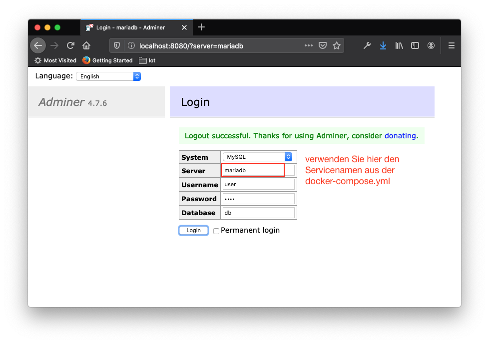

# Mariadb-Container mit adminer


https://www.adminer.org/


## docker-compose.yml

````
version: '3.4'
services:

  mariadb:
    image: mariadb:latest
    restart: always
    ports:
      - 3306:3306
    #volumes:
    #  - ./database:/var/lib/mysql
    environment:
      MYSQL_ROOT_PASSWORD: passme
      #MYSQL_ALLOW_EMPTY_PASSWORD: true
      MYSQL_DATABASE: db
      MYSQL_USER: user
      MYSQL_PASSWORD: user

  adminer:
    image: adminer
    restart: always
    ports:
      - 8080:8080
````

## Starten / Stoppen / ...

````
docker-compose up -d
docker-compose logs
docker-compose down
````

### beim Starten und Stoppen werden die Daten (Container) NICHT zerstört

````
docker-compose start
docker-compose stop
````

## Öffnen des Adminers

http://localhost:8080


